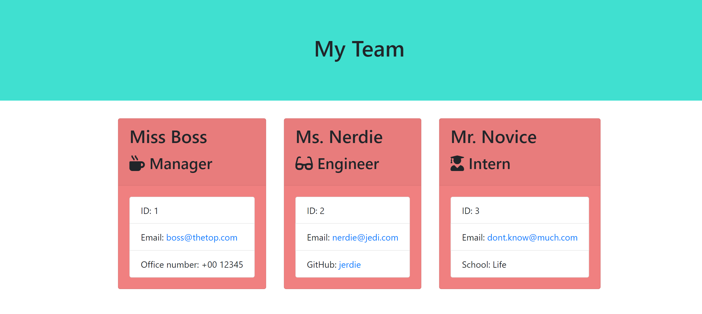

# Team Profile Generator
This application will take in information about employees on a software engineering team via terminal, then generate an HTML webpage that displays summaries for each person.

&nbsp;&nbsp;&nbsp;&nbsp;&nbsp;&nbsp;

---
## Installation

No installation is required.
The following image shows a mock-up of the generated HTML’s appearance and functionality:

## Usage 
Once you open the terminal on the appropriate application folder, access functionality via node index command.

## Credits
* Trilogy Education Services
* [W3Schools](https://www.w3schools.com/)
* [Stack Overflow](https://stackoverflow.com/questions/74075310/how-to-properly-nest-inquirer-prompts)